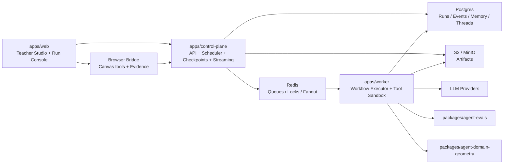

# GeoHelper Platform Agent Rewrite Design

Date: 2026-04-03  
Status: Proposed

## 1. Executive Summary

GeoHelper 当前已经拥有一条结构化、可审查的几何生成链路，但它仍然是 `compile-centric workflow`，不是 `platform-style agent system`。如果目标升级为“平台型 agent”，这次重构不应该继续围绕 `CommandBatch`、`direct/gateway` 和固定 `author/reviewer/reviser` 三段式做增量演化，而应该整体重构为一套以 `run ledger`、`workflow graph`、`tool runtime`、`memory`、`artifact`、`checkpoint` 为核心的 Agent 平台内核。

本方案明确采用 **不兼容重构**：

1. 废弃现有 `POST /api/v2/agent/runs` 的 compile 心智。
2. 废弃 `direct runtime` 与 `gateway runtime` 的双轨产品模型。
3. 废弃把几何领域类型放在平台协议中心的做法。
4. 引入持久化运行时、任务队列、工具注册层、记忆层和人工检查点。
5. 把“几何题图生成”下沉为第一个领域包，而不是平台本体。

推荐方案不是微服务大爆炸，而是 **模块化单体 control plane + 独立 worker + 浏览器 bridge**。这可以同时拿到平台型 agent 所需的耐久运行、工具编排、可恢复状态和较清晰的工程边界，又不会在当前规模过早引入过多分布式复杂度。

## 2. Assumptions

这份设计基于以下默认假设。如果未来目标切换成多租户 SaaS，需要再补一层 tenancy 和 billing 设计，但核心内核仍可复用。

1. 仍然优先服务 GeoHelper 自身产品，而不是先做第三方开放平台。
2. 首版仍然是单租户自托管优先，但不再坚持“纯静态 + 本地优先 + 无 SQL”。
3. 允许引入 `Postgres + Redis + object storage` 作为正式依赖。
4. Web 端继续保留 GeoGebra 画布，但 Agent 运行状态由服务端权威维护。
5. 平台需要支持交互式短任务，也要支持分钟级长任务、人工确认、恢复执行和子 agent。

## 3. Why The Current Architecture Must Be Replaced

当前系统的问题，不是“功能不够多”，而是平台边界被最早的 compile 路径锁住了。

1. 核心协议仍然是几何定制对象。
   - `AgentRunEnvelope` 已经比旧 compile response 好很多，但它的中心仍然是 `GeometryDraftPackage` 与 `GeometryReviewReport`，平台层没有抽象出通用 run、node、artifact、tool call、checkpoint、memory 这些实体。
2. 调度模型仍然是固定链路。
   - 现在的主流程本质是一个 hard-coded loop，最多一次 revise，无法表达 planner、router、tool fan-out、parallel subagent、evaluator、resume 等平台型能力。
3. `direct` 与 `gateway` 双 runtime 阻碍平台内核统一。
   - 平台型 agent 需要统一的 durable run state、统一 trace、统一 tool 权限和统一恢复模型；浏览器本地拼出来的 lightweight envelope 不再适合作为一级运行时。
4. 观测与证据仍偏“本轮请求结果”。
   - 目前有阶段 telemetry 和 teacher packet，但平台所需的 event log、artifact lineage、checkpoint resolution history、tool ledger、memory write audit 还不存在。
5. 几何能力与平台能力缠绕。
   - 几何命名、命令验证、teacher review packet 都直接进入协议与 workflow，本质上意味着未来要加第二个领域时，需要修改平台本身。

结论很直接：如果目标是平台型 agent，现有架构不应该继续扩展，而应该让位给新的内核。

## 4. Capability Goals

目标系统至少要具备以下平台级能力：

1. **Durable runs**
   - 每次运行都可以暂停、恢复、重试、取消、审计。
2. **Workflow graph**
   - 支持 planner、tool、evaluator、checkpoint、subagent、join、router 等节点类型，而不是只支持固定链式 prompt。
3. **Tool runtime**
   - 工具注册、权限模型、参数 schema、执行审计、重试策略、超时策略、隔离策略。
4. **Memory**
   - 线程记忆、工作空间记忆、领域记忆、策略记忆、摘要写入和检索。
5. **Artifacts**
   - 计划、草案、截图、画布证据、工具输出、评审报告、最终答复都成为一等产物。
6. **Human checkpoints**
   - 人工确认不只是一个 UI 动作，而是平台状态机的一部分。
7. **Subagents**
   - 允许父 run 派生子 run，拥有独立 budget、独立 context、独立 artifact 输出。
8. **Evaluators**
   - 独立于主执行链的自动评价器，对正确性、质量、风险和完成度进行结构化打分。
9. **Domain plugins**
   - 几何只是第一个 domain package，后续应能添加其他学科或任务域。
10. **Rich observability**
   - Event stream、run timeline、tool trace、memory writes、checkpoint backlog、artifact lineage。

## 5. Design Options

### Option A: Keep The Gateway, Add Plugins

做法：

1. 保留当前 `apps/gateway` 作为主服务。
2. 在现有 workflow 里继续塞 planner/tool/reviewer。
3. 把几何类型逐步泛化。

优点：

1. 改动最少。
2. 现有测试与 UI 可以复用更多。

缺点：

1. compile 心智会持续污染平台层。
2. 仍然很难引入 durable graph execution。
3. `direct/gateway` 双轨会一直形成技术债。

结论：不推荐。

### Option B: Full Distributed Control Plane

做法：

1. 单独拆出 API、scheduler、worker、artifact service、memory service。
2. 通过消息总线和独立数据库驱动所有执行。

优点：

1. 平台边界最清晰。
2. 理论扩展性最好。

缺点：

1. 对 GeoHelper 当前体量过重。
2. 开发和运维成本陡增。

结论：不作为首选首版。

### Option C: Modular Monolith Control Plane + Worker

做法：

1. 用一个新的 `control-plane` 服务承载 API、scheduler、run store、checkpoint API、artifact metadata。
2. 用一个独立 `worker` 进程执行 workflow node、tool call、subagent。
3. 用共享数据库和 Redis 队列连接两者。
4. 浏览器通过 `browser bridge` 参与画布相关工具和证据提交。

优点：

1. 已满足平台型 agent 的核心需求。
2. 边界清晰，未来可拆。
3. 比纯微服务更适合当前团队规模。

缺点：

1. 必须放弃现在的 static-only/local-first runtime 心智。
2. 需要重建协议、状态管理和测试基座。

结论：**推荐**。

## 6. Recommended Architecture

### 6.1 Topology



### 6.2 New Product Boundary

重构后，系统边界改成：

1. `apps/control-plane`
   - 平台 API、run scheduler、checkpoint 协调、streaming、auth、policy。
2. `apps/worker`
   - 真正执行 workflow graph、调用模型、调用工具、写 event、产出 artifact。
3. `apps/web`
   - Teacher Studio、Run Console、Checkpoint Inbox、Artifact Viewer、Canvas Bridge。
4. `packages/agent-*`
   - 平台核心协议、执行内核、memory、tools、evals、domain adapters。

当前的 `apps/gateway` 不做延续演化，建议整体更名并按职责拆开。

## 7. Core Platform Concepts

### 7.1 First-Class Entities

平台核心实体建议如下：

1. `AgentDefinition`
   - 描述一个 agent 的角色、目标、可用工具、模型策略、默认 workflow。
2. `WorkflowDefinition`
   - 一个可执行 graph，由节点、边、输入映射、退出条件组成。
3. `Run`
   - 一次执行实例，拥有状态、budget、priority、parent/child run 关系。
4. `RunEvent`
   - 不可变事件日志，记录状态转换、tool call、artifact write、checkpoint wait 等。
5. `NodeExecution`
   - graph 中单个节点的执行记录。
6. `Artifact`
   - 一等产物，包含计划、摘要、截图、画布证据、草案、评审报告、最终回复等。
7. `ToolCall`
   - 工具调用记录，包含参数、输出、耗时、重试、错误和权限决策。
8. `Checkpoint`
   - 等待人类或系统外部输入的暂停点。
9. `MemoryEntry`
   - 可检索记忆，按 thread、workspace、domain、policy 分类。
10. `Thread`
   - 用户连续任务上下文。
11. `Workspace`
   - 画布、文件、模板、知识源和长效上下文的容器。

### 7.2 Suggested Type Boundaries

```ts
type RunStatus =
  | "queued"
  | "planning"
  | "running"
  | "waiting_for_checkpoint"
  | "waiting_for_tool"
  | "evaluating"
  | "completed"
  | "failed"
  | "cancelled";

type NodeKind =
  | "planner"
  | "model"
  | "tool"
  | "router"
  | "checkpoint"
  | "evaluator"
  | "subagent"
  | "synthesizer";

interface Run {
  id: string;
  threadId: string;
  workflowId: string;
  agentId: string;
  status: RunStatus;
  parentRunId?: string;
  inputArtifactIds: string[];
  outputArtifactIds: string[];
  budget: {
    maxModelCalls: number;
    maxToolCalls: number;
    maxDurationMs: number;
  };
}
```

## 8. Workflow Execution Model

### 8.1 Graph Instead Of Chain

平台运行不再使用“写死的 author/reviewer/reviser”链，而是采用 graph execution：

1. `planner` 节点负责生成任务图或行动计划。
2. `router` 节点根据 evaluator 或 tool 结果决定下一跳。
3. `tool` 节点执行具体能力。
4. `checkpoint` 节点负责人工确认。
5. `subagent` 节点派生子任务。
6. `evaluator` 节点负责质量门控。
7. `synthesizer` 节点负责最终输出。

### 8.2 Durable Ledger

执行状态不靠内存对象保存，而靠：

1. `RunEvent` 不可变追加日志。
2. `RunSnapshot` 周期性快照。
3. `NodeExecution` 粒度的幂等恢复。

任何 worker 崩溃后，scheduler 都应能基于 ledger 恢复运行。

### 8.3 Retry And Budget

平台级预算需要内建：

1. 每个 run 的模型调用上限。
2. 每个 run 的工具调用上限。
3. 每个节点的超时、退避和最大重试次数。
4. 子 run 继承或覆写预算。
5. 检查点等待超时策略。

## 9. Model Layer

模型层要从“直接调 LiteLLM”升级为可路由能力层：

1. `ModelProfile`
   - 模型名称、上下文长度、工具调用支持、结构化输出支持、成本等级。
2. `ModelPolicy`
   - 不同节点用什么模型、预算和温度。
3. `PromptContract`
   - 节点输入与输出 schema，避免 prompt 文本成为唯一协议。
4. `ProviderAdapter`
   - OpenAI、LiteLLM 或未来其他 provider 的薄适配。

关键点：

1. 模型调用必须写入 `ToolCall` 式 ledger。
2. 平台层不再把模型调用与领域语义耦合。
3. “结构化输出失败”是 evaluator 与 retry 策略的一部分，不是散落在业务代码里。

## 10. Tool Runtime

### 10.1 Tool Classes

工具建议按执行位置分 4 类：

1. `server_tool`
   - 数据库、对象存储、检索、知识库、模板库。
2. `worker_tool`
   - 计算、eval、转换、文件处理。
3. `browser_tool`
   - 读取画布状态、聚焦对象、执行 GeoGebra 命令、抓取截图。
4. `external_tool`
   - 第三方 HTTP API、搜索、远端服务。

### 10.2 Tool Contract

每个工具必须拥有：

1. 名称与版本。
2. 输入/输出 schema。
3. 权限标签。
4. 可否重试。
5. 可否并发。
6. 审计字段脱敏规则。

### 10.3 Isolation

平台型 agent 最大的新增风险是工具执行风险，因此：

1. 工具执行默认在 worker 内隔离。
2. 高风险工具单独沙箱。
3. browser tools 只能通过显式 bridge 调用。
4. 每个工具调用都必须可重放、可审计、可禁止。

## 11. Memory Architecture

记忆层不能等于“把最近几轮对话塞进 prompt”。建议拆成 4 层：

1. `thread_memory`
   - 当前会话的重要结论、用户偏好、待确认事项。
2. `workspace_memory`
   - 当前画布对象、模板来源、题目上下文、最近导入素材。
3. `domain_memory`
   - 几何相关规则、命名偏好、教学表达模板。
4. `policy_memory`
   - 平台策略、风格限制、模型限制、工具白名单。

记忆写入也必须显式化：

1. 不是每次运行都自动写入所有内容。
2. 通过 `memory_write` evaluator 决定什么值得保留。
3. 每条记忆都记录来源 artifact 和 run id。

## 12. Geometry As A Domain Package

几何不再是平台协议，而变成 `packages/agent-domain-geometry`。

### 12.1 Domain Responsibilities

几何领域包负责：

1. 定义 `geometry_solver`、`geometry_teacher_assist` 等 agent。
2. 提供几何 workflow templates。
3. 提供 GeoGebra 相关 tool definitions。
4. 提供几何 evaluator。
5. 提供几何 artifact renderers。
6. 提供 Teacher Studio 的 domain-specific 面板配置。

### 12.2 Suggested Geometry Tools

1. `scene.read_state`
2. `scene.apply_command_batch`
3. `scene.capture_snapshot`
4. `geometry.extract_entities`
5. `geometry.extract_relations`
6. `geometry.validate_constraints`
7. `geometry.find_missing_assumptions`
8. `geometry.generate_teaching_notes`
9. `teacher.request_confirmation`
10. `template.retrieve_similar_examples`

### 12.3 Domain Evaluators

1. `command_batch_validity`
2. `geometric_constraint_consistency`
3. `naming_clarity`
4. `teacher_readiness`
5. `canvas_execution_quality`

这样一来，平台核心只关心 graph、tool、memory、artifact、checkpoint；几何只关心领域语义。

## 13. API Surface

### 13.1 Public APIs

建议重构为新的 `/api/v3`：

1. `POST /api/v3/threads`
2. `GET /api/v3/threads/:threadId`
3. `POST /api/v3/threads/:threadId/runs`
4. `GET /api/v3/runs/:runId`
5. `GET /api/v3/runs/:runId/events`
6. `POST /api/v3/runs/:runId/cancel`
7. `POST /api/v3/checkpoints/:checkpointId/resolve`
8. `GET /api/v3/artifacts/:artifactId`
9. `GET /api/v3/workspaces/:workspaceId/memory`
10. `GET /api/v3/runs/:runId/stream`

### 13.2 Browser Bridge APIs

1. `POST /api/v3/browser-sessions`
2. `POST /api/v3/browser-sessions/:id/tool-results`
3. `POST /api/v3/browser-sessions/:id/canvas-evidence`

### 13.3 Admin APIs

1. `GET /admin/runs`
2. `GET /admin/runs/:runId/timeline`
3. `GET /admin/checkpoints`
4. `GET /admin/tools/usage`
5. `GET /admin/memory/writes`
6. `GET /admin/evals/failures`

## 14. Web App Refactor

Web 端必须从“聊天壳 + 结果面板”升级为“工作台 + 运行控制台”。

### 14.1 New Surfaces

1. `Teacher Studio`
   - 输入题目、查看计划、等待检查点、应用到画布、继续修正。
2. `Run Console`
   - Timeline、tool trace、artifacts、subagents、evals。
3. `Checkpoint Inbox`
   - 人工确认与需要老师参与的决策队列。
4. `Artifact Viewer`
   - 草案、截图、命令差异、教学讲解稿。
5. `Memory Drawer`
   - 当前 run 读写了哪些记忆。

### 14.2 State Model

前端状态不再围绕 `chat message -> result`，而是围绕：

1. `threadStore`
2. `runStore`
3. `artifactStore`
4. `checkpointStore`
5. `workspaceStore`
6. `browserBridgeStore`

### 14.3 Canvas Integration

GeoGebra 画布不再直接由 compile 结果驱动，而是作为 `browser tool target`：

1. run 产出 `command_batch` artifact。
2. 浏览器 bridge 收到可执行任务。
3. 画布执行后回传 `canvas_evidence` artifact。
4. 后续 evaluator 或 reviser 消费该 artifact。

## 15. Storage And Infra

### 15.1 Storage Split

1. `Postgres`
   - threads
   - runs
   - run_events
   - node_executions
   - checkpoints
   - artifacts metadata
   - memory entries
   - policies
2. `Redis`
   - work queues
   - locks
   - run streaming fanout
   - scheduler leases
3. `S3/MinIO`
   - large artifacts
   - screenshots
   - canvas dumps
   - exported plans

### 15.2 Why SQL Is Worth It

平台型 agent 的关键能力是 durable state，而 durable state 的关键是：

1. 可查询的 run graph
2. 可恢复的 checkpoint
3. 可追踪的 event ledger
4. 可筛选的 memory

这些都不适合继续建立在无结构 KV 或本地浏览器状态之上。

## 16. Monorepo Restructure

建议目标结构如下：

```text
apps/
  control-plane/
  worker/
  web/
packages/
  agent-protocol/
  agent-core/
  agent-store/
  agent-memory/
  agent-tools/
  agent-evals/
  agent-domain-geometry/
  browser-bridge/
  shared-ui/
```

### 16.1 Package Intent

1. `agent-protocol`
   - API schema、run schema、artifact schema、checkpoint schema。
2. `agent-core`
   - workflow engine、node execution contracts、scheduler interfaces。
3. `agent-store`
   - Postgres repos、event appenders、snapshots。
4. `agent-memory`
   - retrieval、summarization、write policies。
5. `agent-tools`
   - tool registry、tool contracts、sandbox policies。
6. `agent-evals`
   - generic eval framework。
7. `agent-domain-geometry`
   - 几何 agent、workflow、tool defs、evaluators。
8. `browser-bridge`
   - 浏览器工具会话、GeoGebra 交互 contract。

## 17. No-Compatibility Cutover

既然明确不兼容，切换策略应该是一次大切：

1. 冻结当前 `main` 为最后一个 compile-centric release。
2. 在新分支上创建新的平台骨架，不继续复用 `apps/gateway/src/routes/agent-runs.ts`。
3. 新平台完成前，不在旧架构上继续叠加“准平台能力”。
4. 新系统上线后，旧的 `/api/v2/agent/runs`、`direct-client`、`agent-run-store`、`compile` 相关命名统一删除。

这比长期双栈并行更清晰，也更符合“不要兼容”的前提。

## 18. Migration Strategy

### Phase 0: Freeze And Rename

1. 冻结旧 compile/runtime 命名。
2. 新建 `apps/control-plane`、`apps/worker` 与 `packages/agent-*`。
3. 旧 `packages/protocol` 仅保留 GeoGebra command schema，可后续更名。

### Phase 1: Platform Kernel

1. 建立 run / event / checkpoint / artifact / workflow schema。
2. 建立 Postgres store 与 Redis scheduler。
3. 建立 worker 执行循环。

### Phase 2: Geometry Domain

1. 把几何领域对象和 tool 定义迁入 `agent-domain-geometry`。
2. 用新 workflow 重建当前 teacher studio 主场景。

### Phase 3: Web Cutover

1. Web 改用 thread/run/checkpoint/artifact 状态模型。
2. 引入 browser bridge 和 run console。

### Phase 4: Remove Legacy

1. 删除旧 compile route。
2. 删除 direct runtime。
3. 删除旧 agent run 协议与状态逻辑。

## 19. Risks

### 19.1 Product Risks

1. 平台化会让产品从“轻量工具”变成“有后台状态的系统”，用户部署门槛上升。
2. 如果平台抽象过度，可能反而削弱几何场景体验。

### 19.2 Engineering Risks

1. 事件溯源与恢复逻辑容易复杂化。
2. browser tools 与 worker 的边界设计不好会导致一致性问题。
3. 记忆层如果无约束，很快变成 prompt 垃圾堆。

### 19.3 Control Risks

1. 工具权限必须严控。
2. 子 agent 必须有预算与深度限制。
3. 检查点等待必须有超时与人工兜底。

## 20. Success Metrics

平台重构完成后，成功不再只看“出没出图”，而应看：

1. `run_resume_success_rate`
2. `checkpoint_resolution_time`
3. `tool_success_rate`
4. `artifact_reuse_rate`
5. `eval_pass_rate`
6. `subagent_completion_rate`
7. `time_to_first_meaningful_artifact`
8. `teacher_accept_without_manual_fix_rate`

## 21. Final Recommendation

最终建议是：

1. 采用 **Option C: Modular Monolith Control Plane + Worker**。
2. 主动放弃 `compile-centric`、`direct runtime`、`纯 local-first` 这些旧边界。
3. 把平台层抽象为 `run + workflow + tool + checkpoint + artifact + memory`。
4. 把几何下沉为第一个领域包，而不是继续让平台围着几何协议长。

如果你的目标真的已经从“几何生成 agent”升级成“平台型 agent”，这次重构应该被视为 **产品内核换代**，不是下一轮 feature 开发。
