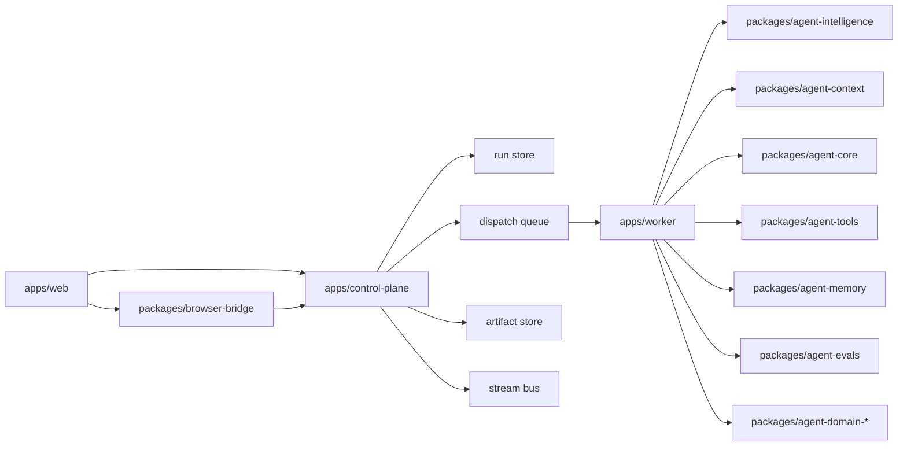

# Platform Agent V2 Rebuild Implementation Plan

> **For Claude:** REQUIRED SUB-SKILL: Use superpowers:executing-plans to implement this plan task-by-task.

**Goal:** Rebuild GeoHelper into a true platform-style agent system with a real intelligence plane, context plane, tool fabric, and operations plane, with no backward compatibility constraints.

**Architecture:** Keep the existing `run + workflow + store` kernel, but narrow each current module to a single responsibility. Move planning, model invocation, synthesis, evaluation, and context assembly out of `apps/worker` stubs into dedicated packages. Treat geometry as a domain package on top of a generic platform runtime, and cut over to a single authoritative control plane plus workers.

**Tech Stack:** TypeScript, Node.js, Fastify, React, Zustand, Zod, Vitest, Playwright, SQLite for local development, Postgres for production durability, Redis or DB-backed dispatch, filesystem or object storage for artifacts

---

## Executive Decision

This rebuild is explicitly **not compatibility-preserving**.

The target system is not "a better geometry workflow". The target system is "a platform agent runtime that happens to ship with geometry as its first domain package".

### Hard decisions

1. `apps/control-plane` becomes the only authoritative backend for agent execution state.
2. `apps/worker` becomes a thin execution shell, not the home of planning logic.
3. `apps/gateway` is either deleted or reduced to a narrow edge facade after cutover.
4. `packages/agent-core` owns execution semantics only, not model reasoning or context building.
5. `packages/agent-domain-geometry` stops exporting platform bootstrap as the top-level runtime composition mechanism.
6. `apps/worker/src/model-dispatch.ts` is deleted and replaced by real node drivers.

## Why A V2 Rebuild Is Necessary

The current codebase already has a credible platform kernel:

- `packages/agent-protocol` defines runs, workflows, checkpoints, artifacts, and run profiles.
- `packages/agent-core` executes workflow graphs and supports checkpoints and subagents.
- `packages/agent-store` persists run state, events, engine state, memory, and artifacts.
- `apps/control-plane` exposes thread, run, stream, checkpoint, and admin APIs.

The current ceiling is equally clear:

- `apps/worker/src/model-dispatch.ts` is still a stub for `planner`, `model`, and `evaluator`.
- `packages/agent-core/src/platform-runtime-context.ts` resolves profiles and assets, but not assembled execution context.
- `apps/control-plane/src/control-plane-context.ts` still boots the runtime directly from geometry bootstrap.
- `packages/agent-tools` and `packages/agent-memory` are useful, but not yet platform-grade fabrics.

That means the project already has a strong execution shell, but not a strong intelligence system.

## Target Capability Model

The rebuilt platform should be judged across six planes:

1. **Contract plane**
   - Typed run, workflow, artifact, checkpoint, memory, and policy contracts.
2. **Execution plane**
   - Durable graph execution, budgets, retries, checkpoints, cancellation, subagent orchestration.
3. **Intelligence plane**
   - Planning, model routing, synthesis, evaluation, reflection, and answer shaping.
4. **Context plane**
   - Assembly of thread history, artifacts, memory, workspace state, tool affordances, and policy instructions.
5. **Tool plane**
   - Registry, schema, policy, isolation, timeout, retry, audit, browser mediation, and external provider adapters.
6. **Ops plane**
   - Timeline, traces, eval reports, queue health, checkpoint inbox, memory lineage, and incident debugging.

The current project is strong on planes 1 and 2, partial on 5 and 6, and weak on 3 and 4.

## Target Topology



## Target Repository Shape

### Apps

- Keep: `apps/control-plane`
- Keep: `apps/worker`
- Keep: `apps/web`
- Delete or shrink hard: `apps/gateway`

### Packages to keep but narrow

- Keep: `packages/agent-protocol`
- Keep: `packages/agent-core`
- Keep: `packages/agent-store`
- Expand: `packages/agent-tools`
- Expand: `packages/agent-memory`
- Refactor: `packages/agent-domain-geometry`

### Packages to add

- Create: `packages/agent-intelligence`
- Create: `packages/agent-context`
- Create: `packages/agent-evals`
- Create: `packages/agent-sdk`
- Optional later: `packages/agent-telemetry`

## Boundary Rules

These rules are the center of the rebuild. If they blur again, the platform will regress into a prompt workflow app.

### `packages/agent-protocol`

Owns:

- `Run`, `RunEvent`, `WorkflowDefinition`, `NodeExecution`, `Artifact`, `Checkpoint`, `MemoryEntry`, `RunProfile`, `PolicyDecision`

Must not own:

- geometry payloads
- model prompts
- tool implementation details
- control-plane route DTO drift

### `packages/agent-core`

Owns:

- workflow graph execution
- node lifecycle and state machine
- budget accounting
- checkpoint pause and resume semantics
- subagent orchestration semantics

Must not own:

- prompt building
- memory retrieval policy
- provider routing
- domain-specific tool logic

### `packages/agent-context`

Owns:

- thread history assembly
- artifact selection
- memory retrieval and ranking
- workspace state hydration
- system prompt and policy packet generation

Must not own:

- durable storage writes
- actual model invocation
- domain tool implementations

### `packages/agent-intelligence`

Owns:

- planner driver
- model driver
- synthesizer driver
- evaluator driver
- reflection and retry policy
- model router and response normalization

Must not own:

- HTTP transport
- raw database access
- browser session mutation

### `packages/agent-tools`

Owns:

- tool definition contract
- provider adapters
- execution policy
- retries, timeouts, redaction, audit
- browser tool handshake and external tool wrappers

Must not own:

- planning logic
- front-end UI state

### `packages/agent-memory`

Owns:

- memory retrieval API
- write policy
- summarization and promotion policy
- dedupe and traceability

Must not own:

- prompt template logic
- workflow orchestration

### `packages/agent-sdk`

Owns:

- domain package registration
- tool and workflow extension points
- run profile builders
- evaluator registration

Must not own:

- platform state persistence
- app route code

## Target Interfaces

```ts
export interface ContextPacket {
  system: string;
  instructions: string[];
  conversation: Array<{ role: "system" | "user" | "assistant"; content: string }>;
  artifacts: Artifact[];
  memories: MemoryEntry[];
  workspace: Record<string, unknown>;
  toolCatalog: ToolManifest[];
}

export interface ContextAssembler {
  assemble(input: {
    run: Run;
    nodeId: string;
    threadId: string;
    workspaceId?: string;
  }): Promise<ContextPacket>;
}

export interface NodeDriver<TConfig = unknown> {
  kind: WorkflowNode["kind"];
  execute(input: {
    run: Run;
    node: WorkflowNode & { config: TConfig };
    context: ContextPacket;
    services: RuntimeServices;
  }): Promise<NodeDriverResult>;
}

export interface ToolProvider {
  type: "server" | "browser" | "external";
  invoke(call: ToolInvocation): Promise<ToolResult>;
}

export interface DomainPackage {
  id: string;
  agents: Record<string, PlatformAgentDefinition>;
  workflows: Record<string, WorkflowDefinition>;
  tools: Record<string, ToolDefinition>;
  evaluators: Record<string, EvaluatorDefinition>;
  runProfiles: Record<string, PlatformRunProfile>;
}
```

## End-To-End Data Flow

1. `apps/web` submits a run request to `apps/control-plane`.
2. `apps/control-plane` creates thread records, input artifacts, a run row, and an initial dispatch item.
3. `apps/worker` claims the dispatch and loads the run snapshot from `packages/agent-store`.
4. `packages/agent-core` asks a node driver to execute the next node.
5. `packages/agent-context` assembles the node-specific context packet.
6. `packages/agent-intelligence` handles planner, model, synthesizer, or evaluator reasoning.
7. `packages/agent-tools` executes server, browser, or external tool calls when requested.
8. `packages/agent-memory` retrieves relevant memory before the node and writes promoted memory after the node.
9. `packages/agent-store` persists events, node executions, checkpoints, and output artifacts.
10. `apps/control-plane` streams incremental state to the web UI and admin surfaces.
11. If a checkpoint is raised, the run pauses until web or browser bridge resolves it.
12. If a subagent is spawned, the parent run waits and is re-enqueued when the child finishes.

## Current-To-Target Mapping

- Replace [apps/worker/src/model-dispatch.ts](/Users/lvxiaoer/Documents/codeWork/GeoHelper/apps/worker/src/model-dispatch.ts) with `packages/agent-intelligence/src/node-drivers/*`.
- Shrink [packages/agent-core/src/platform-runtime-context.ts](/Users/lvxiaoer/Documents/codeWork/GeoHelper/packages/agent-core/src/platform-runtime-context.ts) to registry resolution only.
- Refactor [apps/control-plane/src/control-plane-context.ts](/Users/lvxiaoer/Documents/codeWork/GeoHelper/apps/control-plane/src/control-plane-context.ts) to compose a platform registry instead of directly booting geometry.
- Replace [packages/agent-domain-geometry/src/platform-bootstrap.ts](/Users/lvxiaoer/Documents/codeWork/GeoHelper/packages/agent-domain-geometry/src/platform-bootstrap.ts) with a domain package export consumed by the SDK.
- Expand [packages/agent-tools/src/tool-runner.ts](/Users/lvxiaoer/Documents/codeWork/GeoHelper/packages/agent-tools/src/tool-runner.ts) into a provider-based tool fabric.
- Expand [packages/agent-memory/src/memory-retriever.ts](/Users/lvxiaoer/Documents/codeWork/GeoHelper/packages/agent-memory/src/memory-retriever.ts) into ranked retrieval with explicit policies.

## Implementation Order

The order matters. Do not start with UI polish or domain features. The platform becomes real only when the intelligence plane and context plane exist.

### Phase P0: Reframe The Runtime Around Real Platform Boundaries

**Outcome:** the codebase stops centering geometry bootstrap and stub node handlers.

**Files:**
- Create: `packages/agent-intelligence/package.json`
- Create: `packages/agent-intelligence/src/index.ts`
- Create: `packages/agent-context/package.json`
- Create: `packages/agent-context/src/index.ts`
- Create: `packages/agent-sdk/package.json`
- Create: `packages/agent-sdk/src/index.ts`
- Modify: `pnpm-workspace.yaml`
- Modify: `/Users/lvxiaoer/Documents/codeWork/GeoHelper/package.json`
- Modify: `/Users/lvxiaoer/Documents/codeWork/GeoHelper/README.md`

**Deliverables:**
- package skeletons for intelligence, context, and SDK
- repository-level architecture note updated to target topology
- no new geometry-specific logic added to platform packages

**Verification:**
- `pnpm lint`
- `pnpm typecheck`
- `pnpm test`

### Phase P0.1: Replace Stub Node Dispatch With Real Drivers

**Outcome:** planning and model behavior move out of worker shell code.

**Files:**
- Delete: `apps/worker/src/model-dispatch.ts`
- Create: `packages/agent-intelligence/src/node-drivers/planner-driver.ts`
- Create: `packages/agent-intelligence/src/node-drivers/model-driver.ts`
- Create: `packages/agent-intelligence/src/node-drivers/synthesizer-driver.ts`
- Create: `packages/agent-intelligence/src/node-drivers/evaluator-driver.ts`
- Create: `packages/agent-intelligence/src/model-router.ts`
- Create: `packages/agent-intelligence/src/response-normalizer.ts`
- Modify: `apps/worker/src/worker.ts`
- Modify: `apps/worker/src/run-loop.ts`

**Boundary change:**
- `apps/worker` wires services together but owns no reasoning logic.

**Verification:**
- `pnpm --filter @geohelper/worker test`
- `pnpm --filter @geohelper/agent-core test`

### Phase P0.2: Introduce Context Assembly As A First-Class Plane

**Outcome:** every model-facing node gets deterministic context assembly.

**Files:**
- Create: `packages/agent-context/src/context-assembler.ts`
- Create: `packages/agent-context/src/thread-context.ts`
- Create: `packages/agent-context/src/artifact-context.ts`
- Create: `packages/agent-context/src/memory-context.ts`
- Create: `packages/agent-context/src/workspace-context.ts`
- Create: `packages/agent-context/src/tool-catalog-context.ts`
- Create: `packages/agent-context/src/policy-context.ts`
- Create: `packages/agent-context/test/context-assembler.test.ts`
- Modify: `apps/worker/src/run-loop.ts`
- Modify: `packages/agent-core/src/engine/node-runner.ts`

**Boundary change:**
- `node-runner` requests a `ContextPacket`; it never hand-builds prompt inputs.

**Verification:**
- `pnpm --filter @geohelper/agent-context test`
- `pnpm --filter @geohelper/worker test`

### Phase P0.3: Rewire Platform Composition Around Domain Packages

**Outcome:** control plane loads domain packages through registration, not direct geometry bootstrap.

**Files:**
- Create: `packages/agent-sdk/src/domain-package.ts`
- Create: `packages/agent-sdk/src/platform-registry.ts`
- Create: `packages/agent-sdk/src/register-domain-package.ts`
- Modify: `packages/agent-domain-geometry/src/index.ts`
- Modify: `packages/agent-domain-geometry/src/platform-bootstrap.ts`
- Modify: `apps/control-plane/src/control-plane-context.ts`
- Modify: `apps/control-plane/src/platform-catalog.ts`

**Boundary change:**
- domain packages expose definitions only
- platform runtime composition belongs to SDK plus control plane

**Verification:**
- `pnpm --filter @geohelper/control-plane test`
- `pnpm --filter @geohelper/agent-domain-geometry test`

### Phase P1: Upgrade Tools Into A Real Tool Fabric

**Outcome:** tool execution becomes policy-driven and provider-based.

**Files:**
- Create: `packages/agent-tools/src/providers/server-provider.ts`
- Create: `packages/agent-tools/src/providers/browser-provider.ts`
- Create: `packages/agent-tools/src/providers/external-provider.ts`
- Create: `packages/agent-tools/src/tool-manifest.ts`
- Create: `packages/agent-tools/src/tool-timeouts.ts`
- Create: `packages/agent-tools/src/tool-audit.ts`
- Create: `packages/agent-tools/src/tool-errors.ts`
- Modify: `packages/agent-tools/src/tool-runner.ts`
- Modify: `packages/agent-tools/src/tool-registry.ts`
- Modify: `apps/worker/src/browser-tool-dispatch.ts`

**Boundary change:**
- browser tools are just one provider kind, not a special execution path hidden in worker code

**Verification:**
- `pnpm --filter @geohelper/agent-tools test`
- `pnpm --filter @geohelper/worker test`

### Phase P1.1: Upgrade Memory Into Retrieval Memory

**Outcome:** memory becomes useful to reasoning, not just traceable storage.

**Files:**
- Create: `packages/agent-memory/src/memory-ranker.ts`
- Create: `packages/agent-memory/src/memory-promotion.ts`
- Create: `packages/agent-memory/src/memory-summary.ts`
- Create: `packages/agent-memory/src/memory-window.ts`
- Modify: `packages/agent-memory/src/memory-retriever.ts`
- Modify: `packages/agent-memory/src/memory-writer.ts`
- Modify: `packages/agent-context/src/memory-context.ts`

**Boundary change:**
- memory retrieval returns ranked packets with reasons and scopes
- memory writes are policy-mediated, not ad hoc

**Verification:**
- `pnpm --filter @geohelper/agent-memory test`
- `pnpm --filter @geohelper/agent-context test`

### Phase P1.2: Add Runtime Evaluation And Safety Gates

**Outcome:** quality, correctness, and risk are evaluated as platform behaviors.

**Files:**
- Create: `packages/agent-evals/package.json`
- Create: `packages/agent-evals/src/index.ts`
- Create: `packages/agent-evals/src/runtime-evaluator.ts`
- Create: `packages/agent-evals/src/eval-scorecard.ts`
- Create: `packages/agent-evals/src/policy-gates.ts`
- Create: `packages/agent-evals/test/runtime-evaluator.test.ts`
- Modify: `packages/agent-intelligence/src/node-drivers/evaluator-driver.ts`
- Modify: `apps/control-plane/src/routes/admin-evals.ts`

**Boundary change:**
- evaluator results can block completion, request retry, or force checkpoint

**Verification:**
- `pnpm --filter @geohelper/agent-evals test`
- `pnpm --filter @geohelper/control-plane test`

### Phase P1.3: Rebuild The Run Orchestrator

**Outcome:** run creation, resume, cancel, retry, and child-run propagation are explicit orchestration services.

**Files:**
- Create: `apps/control-plane/src/services/run-orchestrator.ts`
- Create: `apps/control-plane/src/services/run-dispatch.ts`
- Create: `apps/control-plane/src/services/run-stream.ts`
- Create: `apps/control-plane/src/services/checkpoint-orchestrator.ts`
- Modify: `apps/control-plane/src/control-plane-context.ts`
- Modify: `apps/control-plane/src/routes/runs.ts`
- Modify: `apps/control-plane/src/routes/checkpoints.ts`
- Modify: `apps/control-plane/src/routes/stream.ts`

**Boundary change:**
- route handlers stop embedding orchestration logic
- orchestration services become reusable by admin and system automations

**Verification:**
- `pnpm --filter @geohelper/control-plane test`

### Phase P2: Build The Ops Cockpit

**Outcome:** UI becomes a real platform operations surface rather than a lightweight console.

**Files:**
- Create: `apps/web/src/components/admin/RunTracePage.tsx`
- Create: `apps/web/src/components/admin/ToolAuditPanel.tsx`
- Create: `apps/web/src/components/admin/CheckpointQueuePage.tsx`
- Create: `apps/web/src/components/admin/MemoryLineagePage.tsx`
- Modify: `apps/web/src/components/RunConsole.tsx`
- Modify: `apps/web/src/state/run-store.ts`
- Modify: `apps/web/src/state/artifact-store.ts`
- Modify: `apps/web/src/state/checkpoint-store.ts`

**Boundary change:**
- operator views consume the same platform data model as end-user views

**Verification:**
- `pnpm --filter @geohelper/web test`
- `pnpm test:e2e`

### Phase P2.1: Recut Geometry As A Strict Domain Package

**Outcome:** geometry depends on platform interfaces, never the reverse.

**Files:**
- Modify: `packages/agent-domain-geometry/src/agents/geometry-solver.ts`
- Modify: `packages/agent-domain-geometry/src/workflows/geometry-solver-workflow.ts`
- Modify: `packages/agent-domain-geometry/src/run-profiles.ts`
- Modify: `packages/agent-domain-geometry/src/tools/scene-read-state.ts`
- Modify: `packages/agent-domain-geometry/src/tools/scene-apply-command-batch.ts`
- Modify: `packages/agent-domain-geometry/src/evals/teacher-readiness.ts`
- Create: `packages/agent-domain-geometry/test/domain-package-contract.test.ts`

**Boundary change:**
- geometry ships as a clean package registered through `packages/agent-sdk`

**Verification:**
- `pnpm --filter @geohelper/agent-domain-geometry test`
- `pnpm verify:architecture`

### Phase P2.2: Delete Compatibility Surfaces

**Outcome:** the old mental model is physically gone from the codebase.

**Files:**
- Delete: `apps/gateway` or reduce it to a tiny edge-only app
- Delete any dead compile-centric APIs and adapters
- Delete any direct geometry bootstrap references in platform runtime composition
- Update documentation under `docs/api` and `README.md`

**Acceptance rule:**
- no platform package imports geometry-specific types
- no worker stub path returns unconditional `continue`
- no primary UI path depends on removed v2 run concepts

## Acceptance Gates

The rebuild is complete only if all of the following are true:

1. A planner node can produce a plan artifact and influence downstream execution.
2. A model node consumes a deterministic `ContextPacket` built by `packages/agent-context`.
3. A tool node can invoke server, browser, and external tools through one tool fabric.
4. An evaluator can block completion or trigger retry based on structured scorecards.
5. A child run can complete and deterministically resume its parent.
6. Memory retrieval is ranked and scoped, not just a flat fetch.
7. Control plane can inspect run traces, checkpoints, eval failures, and tool audit.
8. Geometry package can be removed without breaking the platform packages.

## Suggested Delivery Sequence

If one engineer leads the rebuild, use this order:

1. P0
2. P0.1
3. P0.2
4. P0.3
5. P1
6. P1.1
7. P1.2
8. P1.3
9. P2
10. P2.1
11. P2.2

If two engineers work in parallel:

- Engineer A owns `agent-intelligence`, `agent-context`, and worker integration.
- Engineer B owns control-plane orchestration, tool fabric, and web ops surfaces.
- Domain recut and compatibility deletion happen only after the platform contracts stabilize.

## Risks

1. Reusing current package names may hide old assumptions. Enforce boundary rules in tests.
2. Without context assembly discipline, model quality will remain unstable even after new packages exist.
3. Without physically deleting old compatibility code, the team will keep routing around the new architecture.
4. If browser tools remain special-cased, the tool fabric will fragment again.

## Recommended First Commit Series

1. `chore: scaffold intelligence context and sdk packages`
2. `feat: replace worker stub dispatch with node drivers`
3. `feat: add context packet assembly pipeline`
4. `feat: register domain packages through platform sdk`
5. `feat: upgrade tool runner into provider fabric`
6. `feat: add retrieval memory and runtime eval gates`
7. `feat: add run orchestrator services and ops cockpit`
8. `refactor: recut geometry as pure domain package`
9. `chore: remove compatibility surfaces`
